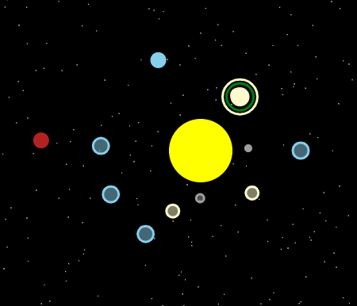

nsh and I wrote "music of the spheres". They came up with the idea and did the music, I added a little bit of programming.

Demo available here [here](https://za3k.github.io/ha3k-30-musicofspheres).

This is part of [hack-a-day](https://za3k.com/hackaday), a challenge to make one project each day in november.
